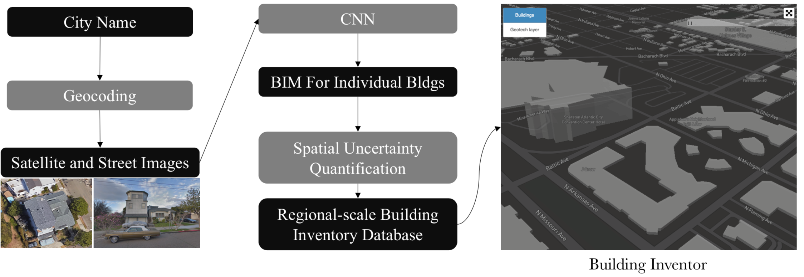
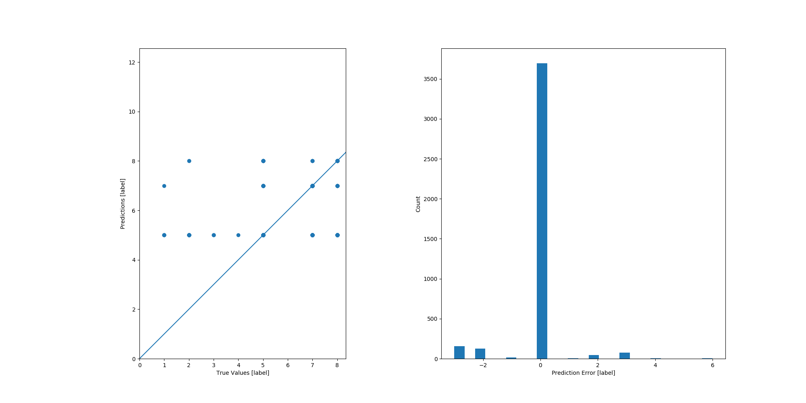
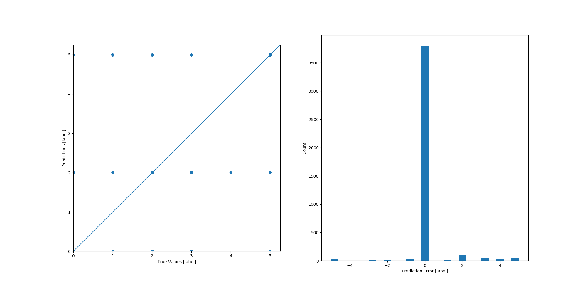
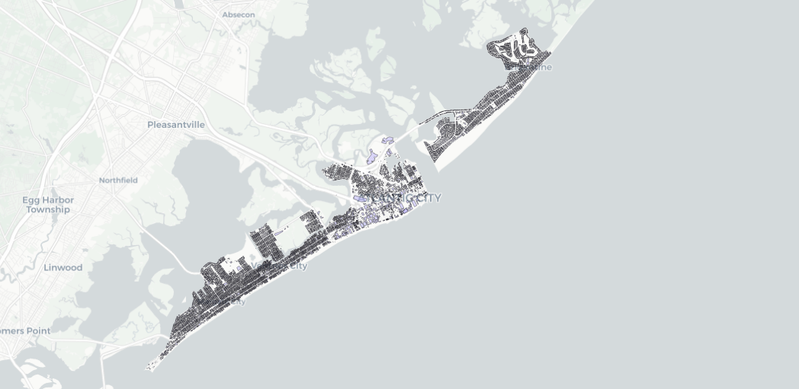
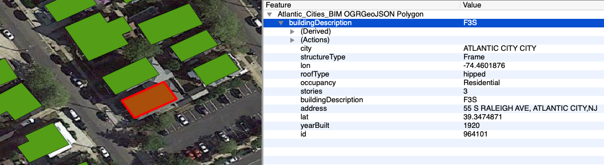

# BIM.AI




AI-Based Pipeline for Regional Building Inventory Procurement

# 

###### Tested with Tensorflow in Python 3.6.6 

### 1. Data preparation 


[Prepare data](src/preparedata/README.md)


### 2. Train

##### Roof
###### training
```
cd src/training/roof/2_train
# train (better to run on a GPU machine)
sh finetune_inception_v3_on_roof_train.sh
```

The training takes a long time on laptops. 
If you don't want to run the training process, we have a CNN trained on TACC and can be downloaded [here](https://berkeley.box.com/shared/static/wfwf4ku9561lcytldy1p7vkjoobgv9sz.zip).
Put the downloaded file inside src/training/roof/tmp/roof-traindir/ and unzip it.

###### testing

 Before your run the test *"sh finetune_inception_v3_on_roof_eval.sh"*, make sure you set the following variables correctly in *"finetune_inception_v3_on_roof_eval.sh"*:
 ```
 checkpoint_file = the-path-of-your-checkpoint-file
 TEST_DIR = the-path-of-your-testing-images-dir
 ```
Now you can test if the trained CNN works or not:
 ```
cd src/training/roof/2_train
sh finetune_inception_v3_on_roof_eval.sh
```


### 3. Predict

##### Roof
Now we use the CNN to predict roof types based on satellite images.

Firstly we need to download those images by calling Google API (will cost $).

```
cd src/predicting
python downloadRoofImages.py
```

To save $, instead of running the above python, you can just download them 
[here](https://berkeley.box.com/shared/static/n8l9kusi9eszsnnkefq37fofz22680t2.zip).


Now we can make predictions:

```
cd src/predicting
sh classifyRoof.sh
```
This script will look into the BIM file and call CNN to predict the roof type of a building if the image is downloaded.

If the image is not downloaded, it will assign a null value for the roof type in the new BIM file.


### 4. Enhance

Use [*SURF*](https://github.com/charlesxwang/SURF) to predict missing building information:


##### Year built


##### Number of stories 


##### Structure type



##### Occupancy




### 5. BIM data release
SimCenter will post obtained data here.
##### Data 1. Atlantic coastal cities, NJ -> [Download](https://berkeley.box.com/shared/static/5tb6gszbbyj35bgpypk1gsdem0ntt5ca.geojson)



### 6. Trained CNN  

https://berkeley.box.com/shared/static/awyyc22sjwknn9xg3p7wru4v5zwnlkjp.zip

### 7. Test dataset
https://berkeley.box.com/shared/static/wfwf4ku9561lcytldy1p7vkjoobgv9sz.zip

