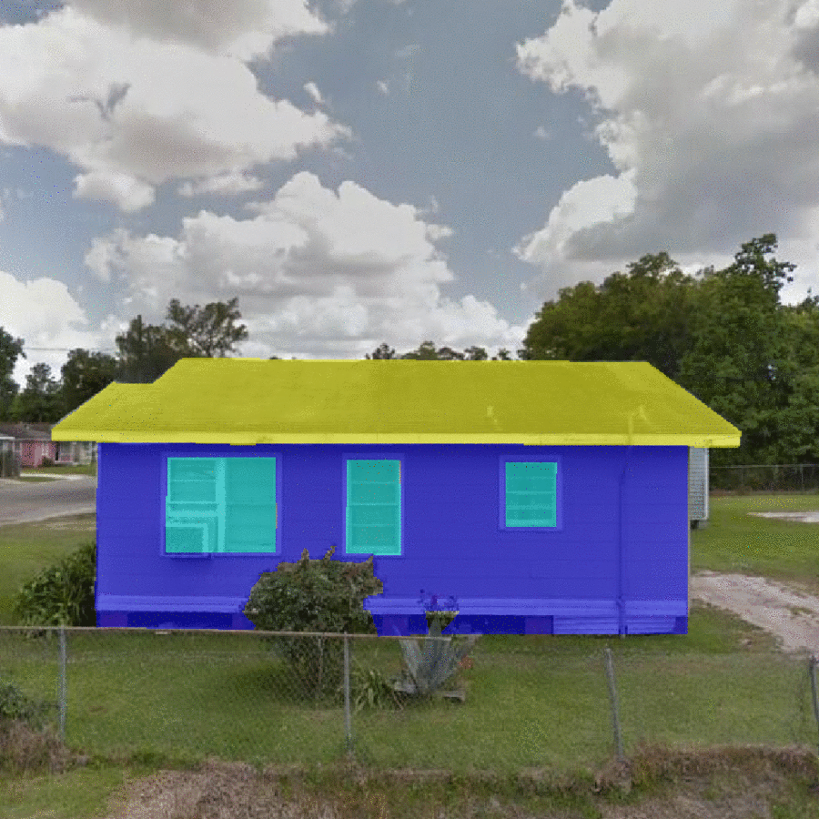

Facade Parser
=================================================

Purpose of the Module
------------------------------------------
This module enables automated predictions of building eave height, roof peak height, roof pitch angle and ratio of window area to facade area from image input.

   Figure 1: Sample facade segmentations of the pretrained model provided with this module. Pixels highlighted in yellow, blue and cyan denote roof, facade and windows masks, respectively.

Copyright
~~~~~~~~~
::

    Copyright (c) 2021, The Regents of the University of California
    Contact: Barbaros Cetiner at bacetiner@ucla.edu

BSD 3-Caluse license
~~~~~~~~~~~~~~~~~~~~~
::

    Redistribution and use in source and binary forms, with or without
    modification, are permitted provided that the following conditions are met:

    * Redistributions of source code must retain the above copyright notice, this
      list of conditions and the following disclaimer.

    * Redistributions in binary form must reproduce the above copyright notice,
      this list of conditions and the following disclaimer in the documentation
      and/or other materials provided with the distribution.

    * Neither the name of the copyright holder nor the names of its
      contributors may be used to endorse or promote products derived from
      this software without specific prior written permission.

    THIS SOFTWARE IS PROVIDED BY THE COPYRIGHT HOLDERS AND CONTRIBUTORS "AS IS"
    AND ANY EXPRESS OR IMPLIED WARRANTIES, INCLUDING, BUT NOT LIMITED TO, THE
    IMPLIED WARRANTIES OF MERCHANTABILITY AND FITNESS FOR A PARTICULAR PURPOSE ARE
    DISCLAIMED. IN NO EVENT SHALL THE COPYRIGHT HOLDER OR CONTRIBUTORS BE LIABLE
    FOR ANY DIRECT, INDIRECT, INCIDENTAL, SPECIAL, EXEMPLARY, OR CONSEQUENTIAL
    DAMAGES (INCLUDING, BUT NOT LIMITED TO, PROCUREMENT OF SUBSTITUTE GOODS OR
    SERVICES; LOSS OF USE, DATA, OR PROFITS; OR BUSINESS INTERRUPTION) HOWEVER
    CAUSED AND ON ANY THEORY OF LIABILITY, WHETHER IN CONTRACT, STRICT LIABILITY,
    OR TORT (INCLUDING NEGLIGENCE OR OTHERWISE) ARISING IN ANY WAY OUT OF THE USE
    OF THIS SOFTWARE, EVEN IF ADVISED OF THE POSSIBILITY OF SUCH DAMAGE.

Installation
---------------------------
The following commands clone the BRAILS repository and install the facade parsing module. Requirements are installed using pip and weights of all used models are downloaded. Make sure to run the last line to add the current folder to the PYTHONPATH variable to avoid issues in training.

::

    git clone https://github.com/NHERI-SimCenter/BRAILS.git BRAILS
    cd BRAILS/brails/modules/FacadeParser
    python3 -m pip install -r requirements.txt
    export PYTHONPATH=$PYTHONPATH:`pwd`

Program 
---------------------------

Input Data Format for Training and Testing
~~~~~~~~~~~~~~~~~~~~~~~~~~~~~~~~~~~~~~~~~~~

Training, validation, and test folders should be separate. All three folders must follow the convention defined below. For training a model using a custom dataset, training and validation folders must exist and images and segmentations masks shall be placed under separate folders.
::

    ROOT_FOLDER
    ├── train
    │   ├── images
    │   │      ├──── image1.jpg
    │   │      ├──── image2.jpg
    │   │      └──── .......... (and so on)
    │   └── masks
    │          ├──── image1mask.jpg
    │          ├──── image2mask.jpg
    │          └──── .......... (and so on)
    ├── valid
    │   ├── images
    │   │      ├──── image1.jpg
    │   │      ├──── image2.jpg
    │   │      └──── .......... (and so on)
    │   └── masks
    │          ├──── image1mask.jpg
    │          ├──── image2mask.jpg
    │          └──── .......... (and so on)
    └── test

Running the Module Using the Pretrained Facade Segmentation Module
~~~~~~~~~~~~~~~~~~~~~~~~~~~~~~~~~~~~~~~~~~~~~~~~~~~~~~~~~~~~~~~~~~~~~

The module is bundled with a facade segmentation model, trained on 5,000 training samples. This model can be called out-of-the-box via ``infer.py``., which includes a post-processor custom-tailored to calculate building eave height, roof peak height, roof pitch angle, and the ratio of window area to facade area from the segmentation masks. The basic syntax to perform inferences on a set of images requires defining the path for the image files and the type of computational environment (i.e., use of CPU or GPU units for inference) by the user as follows.

::

    python3 infer.py
	--im_path "/path/to/images/"
        --gpu_enabled True

Using the command line option ``--model_path``, ``infer.py`` can be called with a custom model trained by the user. For a brief description of all the options built into ``infer.py``, please use the ``infer.py --help`` syntax. Below is a complete list of these options.

.. parsed-literal::

    --im_path (default: "datasets/test/") Path for the building images that will be inferred by module. Must end with backward slash.

    --model_path (default: "models/efficientdet-d4_trained.pth") Path for the pretrained inference model.
                                                                 Do NOT define this argument if the pretrained model bundled with the module will be used

    --gpu_enabled (default: True) Enable GPU processing (Enter False for CPU-based inference)

    --save_segimages (default: False) True if you would like segmentation masks saved in PNG format.

    --segim_path', (default: "segmentedImages") Path for the building segmentation mask images.

Model Training
~~~~~~~~~~~~~~~

If the user wishes to further train the pretrained segmentation model that is bundled with this module, or train a separate model by finetuning a segmentation model already trained on on a subset of COCO 2017 data for the 20 categories that are present in the Pascal VOC dataset, using custom data; the folder structure shown in `Input Data Format for Training and Testing`_ shall be strictly followed. Model training is performed using ``train.py``. 

Following is a comprehensive list of the available command line parameters. The user may also use the ``train.py --help`` syntax to view a brief version of the list below.

.. parsed-literal::

    --data_path (default: "datasets/") Path for the root folder of dataset.

    --architecture (default: deeplabv3_resnet101) Model architecture. Available options: fcn_resnet50, fcn_resnet101, deeplabv3_resnet50, deeplabv3_resnet101

    --num_workers (default: 0) Number of loader processes to use with Pytorch DataLoader

    --optim (default: "adam") Optimizer used for training. Available options: Adam and SGD. 

    --lr (default: 0.0001) Optimizer learning rate

    --batch_size (default: 2) The number of images used per training step

    --num_epochs (default: 25) Number of training epochs

For example, the command to train a segmentation model by **fine-tuning the DeepLabV3-ResNet101 segmentation model trained on COCO dataset** for **25 epochs** using a **learning rate of 0.0001**:

::

    python3 train.py
	--architecture deeplab_resnet50
	--num_epochs 25
	--lr 0.0001