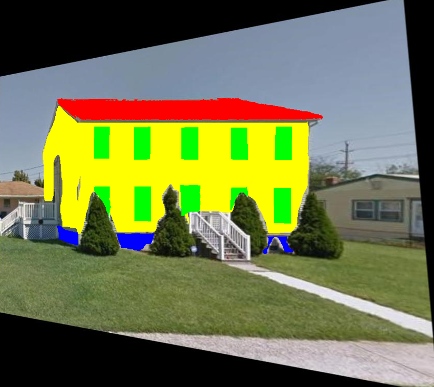

Facade Segmentation
=================================================

Purpose of the Module
------------------------------------------
This module enables automated segmengtation of a building's facade from image input.

   Figure 1: Sample facade segmentation

Copyright
~~~~~~~~~
::

    Copyright (c) 2020, The Regents of the University of California
    Contact: Barbaros Cetiner at bacetiner@ucla.edu

BSD 3-Caluse license
~~~~~~~~~~~~~~~~~~~~~
::

    Redistribution and use in source and binary forms, with or without
    modification, are permitted provided that the following conditions are met:

    * Redistributions of source code must retain the above copyright notice, this
      list of conditions and the following disclaimer.

    * Redistributions in binary form must reproduce the above copyright notice,
      this list of conditions and the following disclaimer in the documentation
      and/or other materials provided with the distribution.

    * Neither the name of the copyright holder nor the names of its
      contributors may be used to endorse or promote products derived from
      this software without specific prior written permission.

    THIS SOFTWARE IS PROVIDED BY THE COPYRIGHT HOLDERS AND CONTRIBUTORS "AS IS"
    AND ANY EXPRESS OR IMPLIED WARRANTIES, INCLUDING, BUT NOT LIMITED TO, THE
    IMPLIED WARRANTIES OF MERCHANTABILITY AND FITNESS FOR A PARTICULAR PURPOSE ARE
    DISCLAIMED. IN NO EVENT SHALL THE COPYRIGHT HOLDER OR CONTRIBUTORS BE LIABLE
    FOR ANY DIRECT, INDIRECT, INCIDENTAL, SPECIAL, EXEMPLARY, OR CONSEQUENTIAL
    DAMAGES (INCLUDING, BUT NOT LIMITED TO, PROCUREMENT OF SUBSTITUTE GOODS OR
    SERVICES; LOSS OF USE, DATA, OR PROFITS; OR BUSINESS INTERRUPTION) HOWEVER
    CAUSED AND ON ANY THEORY OF LIABILITY, WHETHER IN CONTRACT, STRICT LIABILITY,
    OR TORT (INCLUDING NEGLIGENCE OR OTHERWISE) ARISING IN ANY WAY OUT OF THE USE
    OF THIS SOFTWARE, EVEN IF ADVISED OF THE POSSIBILITY OF SUCH DAMAGE.

Installation
---------------------------
The following commands clone the BRAILS repository and install the number of floor detection module. Requirements are installed using pip and weights of all used models are downloaded. Make sure to run the last line to add the current folder to the PYTHONPATH variable to avoid issues in training.

::

    git clone https://github.com/NHERI-SimCenter/BRAILS.git BRAILS
    cd BRAILS/brails/modules/Facade_Segmentation
    python3 -m pip install -r requirements.txt
    export PYTHONPATH=$PYTHONPATH:`pwd`

Program 
---------------------------

Input Data Format for Training and Testing
~~~~~~~~~~~~~~~~~~~~~~~~~~~~~~~~~~~~~~~~~~~

Training, validation, and test folders should be separate. All three folders must be stored in the COCO format and follow the convention defined below. For training a model using a custom dataset, training, validation, and annotations folders must exist. Bounding box annotations for the training and validation folders shall be placed under the annotations folder. The current version of the module only takes horizontal bounding box input. 
::

    IMG_FOLDER
    ├── train
    │   ├── image1.jpg
    │   ├── image2.jpg
    │   └── .......... (and so on)
    ├── valid
    │   ├── image1.jpg
    │   ├── image2.jpg
    │   └── .......... (and so on)
    ├── test
    │   ├── image1.jpg
    │   ├── image2.jpg
    │   └── .......... (and so on)
    └── annotations 
        ├── instances_train.json
        ├── instances_valid.json
        └── classes.txt
