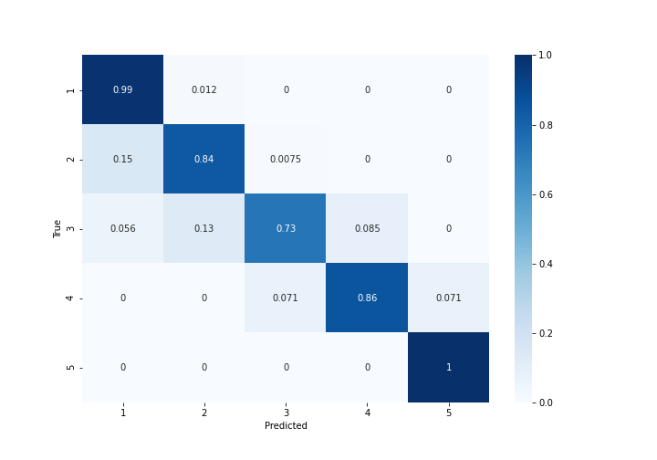
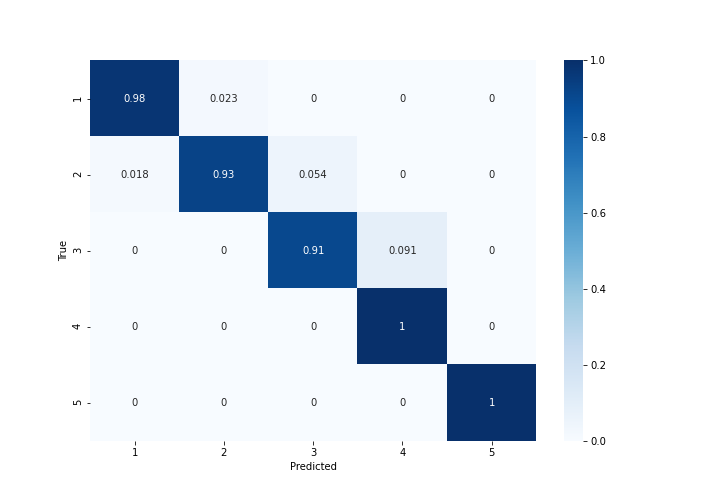

.. _lbl-nfloorDetector-vnv:

Number of Floors Detector
==============================

On a randomly selected set of in-the-wild building images from New Jersey's Bergen, Middlesex, and Moris Counties, the model attains an F1-score of 86%. Here, in-the-wild building images are defined as street-level photos that may contain multiple buildings and are captured with random camera properties. :numref:`confusion_nFloorWildv2` is the confusion matrix of the model inferences on the aforementioned in-the-wild test set.

.. _confusion_nFloorWild:

   Confusion matrix of the pretrained model on the in-the-wild test set

If the test images are constrained such that a single building exists in each image, the building is viewed with minimal obstructions, and the images are captured such that the image plane is nearly parallel to the frontal plane of the building facade, the F1-score of the model is determined as 94.7%. :numref:`confusion_nFloorClean` shows the confusion matrix for the pretrained model on a test set generated according to these constraints.

.. _confusion_nFloorCleanv2:

   Confusion matrix of the pretrained model on the dataset containing lightly distorted/obstructed images of individual buildings

:numref:`inTheWild_Removed` shows a sample of images  removed from the in-the-wild test set that were found to display weak resemblance of the visual cues necessary for a valid number of floor predictions.

.. _inTheWild_Removed:
.. list-table:: In-the-wild street level imagery removed as a part of dataset cleaning

    * - .. figure:: ../../images/technical/occluded1.jpg

            Heavily occluded building facade

      - .. figure:: ../../images/technical/multipleBuildings.jpg

            Closely spaced buildings: obscure prediction target 

    * - .. figure:: ../../images/technical/persDistort.jpg

            Significant perspective distortions

      - .. figure:: ../../images/technical/occluded2.jpg

            Heavily occluded building facade