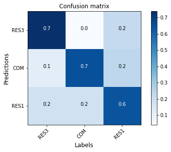

.. _lbl-occupancyClassifier-vnv:

Occupancy Classifier
========================

The Occupancy Classifier's methodology has been presented in :ref:`occupancyTheory`, and examples showing how to use it can be found in :ref:`lbl-occupancyClassifier`.
This section presents its validation against two datasets.

Dataset 1: Compare with OpenStreetMap Labels
~~~~~~~~~~~~~~~~~~~~~~~~~~~~~~~~~~~~~~~~~~~~~

The trained classifier is tested on a ground truth dataset that can be downloaded from `here <https://zenodo.org/record/4553803/files/occupancy_validation_images.zip>`_.
We firstly obtained a set of randomly selected buildings in the United States with occupancy tags found on OpenStreetMap.
We then downloaded the street view images from Google Street View for each building. 
We removed images in which we didn't clearly see there is a building. 
The dataset contains 98 single family buildings (RES1), 97 multi-family buildings (RES3) and 98 commercial buildings (COM). 
Examples of these street view images can be found in :ref:`lbl-occupancyClassifier`. 

Run the following python script to test on this dataset.

.. code-block:: python 

    # download the testing dataset

    import wget
    import zipfile
    wget.download('https://zenodo.org/record/4553803/files/occupancy_validation_images.zip')
    with zipfile.ZipFile('occupancy_validation_images.zip', 'r') as zip_ref:
        zip_ref.extractall('.')

    # prepare the image lists

    import shutil
    import os
    import pandas as pd
    from glob import glob

    class_names = ['RES3', 'COM' ,'RES1']

    labels = []
    images = []
    for clas in class_names:
        imgs = glob(f'occupancy_validation_images/{clas}/*.jpg')
        for img in imgs:
            labels.append(clas)
            images.append(img)

    # import the module
    from brails.modules import OccupancyClassifier

    # initialize the classifier
    occupancyModel = OccupancyClassifier()

    # use the model to predict
    pred = occupancyModel.predict(images)
    predictions = pred['prediction'].tolist()

    # Plot results
    from brails.utils.plotUtils import plot_confusion_matrix
    from sklearn.metrics import confusion_matrix
    from sklearn.metrics import f1_score,accuracy_score

    print(' Accuracy is   : {}, Random guess is 0.33'.format(accuracy_score(predictions,labels)))
    cnf_matrix = confusion_matrix(predictions,labels)
    plot_confusion_matrix(cnf_matrix, classes=class_names, title='Confusion matrix',normalize=False,xlabel='Labels',ylabel='Predictions')

The confusion matrix tested on this dataset is shown in :numref:`fig_confusion_occupancyv2`.

.. _fig_confusion_occupancyv2:

  Confusion matrix - Occupancy Class classifier

The accuracy for the two classes are:

* RES3: Accuracy = 0.97, F1 = 0.97
* COM: Accuracy = 0.97, F1 = 0.98
* RES1: Accuracy = 0.99, F1 = 0.97

Dataset 2: Compare with NJDEP Dataset 
~~~~~~~~~~~~~~~~~~~~~~~~~~~~~~~~~~~~~~~~~~~~~~~~~~~~~~~~~~~~~~~~~~~~~~
  

The second validation dataset is from New Jersey Department of Environmental Protection (NJDEP). 

NJDEP developed a building inventory for flood hazard and risk analysis as part of its flood control and resilience mission.
In this dataset, we can find building footprints with their occupancy types labelled. 
We randomly selected a subset of those records, for each we downloaded a street view image from Google Maps Static API.

Examples of these satellite images can be found in :ref:`occupancyTheory`.

The NJDEP occupancy data includes the following labels:

* RES1     26574
* RES3A     1714
* COM1      1110
* RES3B     1016
* RES3C      779
* RES3D      566
* COM8       187
* AGR1       113
* RES4       111
* COM4       100
* GOV1        90
* IND2        83
* COM3        74
* REL1        67
* RES3E       52
* EDU1        48
* IND3        37
* GOV2        24
* COM7        16
* RES3F       15
* IND1        13
* EDU2        11
* IND4        11
* IND5         6
* COM2         3
* COM10        3
* COM6         2
* IND6         2
* COM5         1             

The BRAILS occupancy system include the following classes:

* RES1
* RES3
* COM

To compare these two systems, we renamed some NJDEP labels:

* RES1  -> RES1
* RES3A -> RES3
* RES3B -> RES3
* RES3C -> RES3
* RES3D -> RES3
* RES3F -> RES3
* RES3E -> RES3
* COM1  -> COM
* COM2  -> COM
* COM3  -> COM
* COM4  -> COM
* COM5  -> COM
* COM6  -> COM
* COM7  -> COM
* COM8  -> COM
* COM10 -> COM
  

From the relabelled records, we selected the following for validation:

* RES1,    1,000 randomly selected from RES1
* RES3,    1,000 randomly selected from RES3
* COM,    1,000 randomly selected from COM

You can download the labels, images, scripts for this validation from `here <https://zenodo.org/record/4774367/files/AtlanticCountyNJDEP_Occupancy_Validation.zip>`_.

The following shows the script to run this validation.
At the end, the script will plot a confusion matrix and print the accuracy.

.. code-block:: python 

    import pandas as pd
    data = pd.read_csv("AtlanticCountyBuildingInventory.csv")
    data.describe()

    def getCls(x):
        if 'RES1' in x:
            return 'RES1'
        elif 'RES3' in x:
            return 'RES3'
        elif 'COM' in x:
            return 'COM'
        else: return 'remove'

    data['occupancy']=data['OccupancyClass'].apply(lambda x: getCls(x))

    #data=data[data['occupancy']!='remove']
    RES1 = data[data['occupancy']=='RES1'].sample(n=1000, random_state = 1993)
    RES3 = data[data['occupancy']=='RES3'].sample(n=1000, random_state = 1993)
    COM = data[data['occupancy']=='COM'].sample(n=1000, random_state = 1993)
    data = pd.concat([RES1,RES3,COM])

    # ### Use BRAILS to download street view images

    import sys
    sys.path.append("/Users/simcenter/Codes/SimCenter/BIM.AI")
    from brails.workflow.Images import getGoogleImagesByAddrOrCoord

    addrs =  list(data[['Longitude','Latitude']].to_numpy())
    getGoogleImagesByAddrOrCoord(Addrs=addrs, GoogleMapAPIKey='Your-Key',
                                 imageTypes=['StreetView'],imgDir='tmp/images',ncpu=2,
                                 fov=60,pitch=0,reDownloadImgs=False)

    data['StreetViewImg']=data.apply(lambda row: f"tmp/images/StreetView/StreetViewx{'%.6f'%row['Longitude']}x{'%.6f'%row['Latitude']}.png", axis=1)

    import os
    import shutil
    # Remove empty images
    data = data[data['StreetViewImg'].apply(lambda x: os.path.getsize(x)/1024 > 9)]
    # Remove duplicates
    data.drop_duplicates(subset=['StreetViewImg'], inplace=True)

    # ### Predict

    from brails.modules import OccupancyClassifier
    occupancyModel = OccupancyClassifier()
    occupancyPreds = occupancyModel.predict(list(data['StreetViewImg']))

    data['Occupancy(BRAILS)']=list(occupancyPreds['prediction'])
    data['prob_Occupancy(BRAILS)']=list(occupancyPreds['probability'])

    # ### Plot confusion matrix

    import sys
    import matplotlib.pyplot as plt
    get_ipython().run_line_magic('matplotlib', 'inline')
    sys.path.append(".")

    from plotUtils import plot_confusion_matrix
    from sklearn.metrics import confusion_matrix
    from sklearn.metrics import f1_score,accuracy_score,f1_score

    class_names = list(data['Occupancy(BRAILS)'].unique())

    predictions = data['Occupancy(BRAILS)']
    labels = data['occupancy']

    cnf_matrix = confusion_matrix(labels,predictions,labels=class_names)
    plot_confusion_matrix(cnf_matrix, classes=class_names, normalize=True,xlabel='BRAILS',ylabel='NJDEP')

    for i,cname in enumerate(class_names):
        accuracy = '%.1f'%(cnf_matrix[i][i]/sum(cnf_matrix[i]))
        TP = cnf_matrix[i][i]
        FP = sum(cnf_matrix[:,i])-cnf_matrix[i,i]
        FN = sum(cnf_matrix[i,:])-cnf_matrix[i,i]
        F1 = '%.1f'%(TP/(TP+0.5*(FP+FN)))

        print(f'{cname}: Accuracy = {accuracy}, F1 = {F1}')

    # ### Copy images to directories {label}-{prediction} for inspection

    import os
    import shutil

    predDir = 'tmp/images/occupancy_predictions'
    if not os.path.exists(predDir):
        os.makedirs(predDir)

    falseNames = []
    def copyfiles(bim):
        for ind, row in bim.iterrows():
            label = row['occupancy']
            pred = row['Occupancy(BRAILS)']

            lon, lat = '%.6f'%row['Longitude'], '%.6f'%row['Latitude']

            oldfile = f'tmp/images/StreetView/StreetViewx{lon}x{lat}.png'
            newfile = f'{predDir}/{label}-{pred}/StreetViewx{lon}x{lat}.png'

            thisFileDir = f'{predDir}/{label}-{pred}/'
            if not os.path.exists(thisFileDir): os.makedirs(thisFileDir)

            try:
                shutil.copyfile(oldfile, newfile)
            except:
                print(oldfile)

    copyfiles(data)         

In the files you downloaded, there are folders with names like RES-COM, which means those are images that are labelled as 'RES' in NJDEP dataset,
but they are predicted as 'COM'. You can browse through those images to investigate deeper.  

The confusion matrix tested on this dataset is shown in :numref:`fig_confusion_occupancy_njdep_v2`.

.. _fig_confusion_occupancy_njdep_v2:
.. figure:: ../../images/technical/njdep/fig_confusion_occupancy_njdep_v2.png
  :width: 40%
  :alt: Confusion matrix occupancy NJDEP

  Confusion matrix - Occupancy type classification for NJDEP

The accuracy for the two classes are:

* RES1: Accuracy = 0.89, F1 = 0.86
* RES3: Accuracy = 0.92, F1 = 0.83
* COM: Accuracy = 0.67, F1 = 0.79

Examples of false predictions are shown in :numref:`atlantic_occupancy_examples_njdep_falsev2`.

.. _atlantic_occupancy_examples_njdep_falsev2:
.. list-table:: Example of false predictions

    * - .. figure:: ../../images/technical/njdep/false/RES1-RES3/StreetViewx-74.366315x39.422974.png

            Label: RES1, BRAILS Prediction: RES3

      - .. figure:: ../../images/technical/njdep/false/RES1-RES3/StreetViewx-74.366873x39.420778.png

            Label: RES1, BRAILS Prediction: RES3

      - .. figure:: ../../images/technical/njdep/false/RES3-COM/StreetViewx-74.417573x39.372665.png

            Label: RES3, BRAILS Prediction: COM

      - .. figure:: ../../images/technical/njdep/false/RES3-COM/StreetViewx-74.418175x39.369580.png

            Label: RES3, BRAILS Prediction: COM

.. note::
    Bias in dataset is very common. 
    This validation doesn't consider the possible bias in the labels (examples can be found in :numref:`njdep_occupancy_examples_biasv2`), which also negatively influences the accuracy. 

.. _njdep_occupancy_examples_biasv2:
.. list-table:: Example of street view images: Bias in the labels

    * - .. figure:: ../../images/technical/njdep/RES1-COM/StreetViewx-74.544719x39.459546.png

            Label: RES1, BRAILS Prediction: COM

      - .. figure:: ../../images/technical/njdep/RES1-RES3/StreetViewx-74.358387x39.411702.png

            Label: RES1, BRAILS Prediction: RES3

      - .. figure:: ../../images/technical/njdep/RES3-COM/StreetViewx-74.412689x39.368096.png

            Label: RES3, BRAILS Prediction: COM

      - .. figure:: ../../images/technical/njdep/RES3-RES1/StreetViewx-74.406136x39.382882.png

            Label: RES3, BRAILS Prediction: RES1

