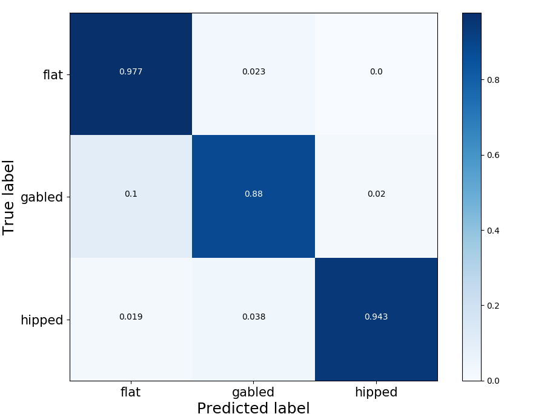

.. _lbl-roofClassifier-vnv:

Roof Classifier
========================

The Roof Classifier is validated here.

The trained classifier is tested on a ground truth `dataset <http://doi.org/10.5281/zenodo.4520781>`_.
Accuracy is 90.3%. Precision is 90.3%. Recall is 90.3%. F1 is 90.3%.

Run the following python script to test on this dataset.

.. code-block:: python 

    
    import shutil
    import os
    import pandas as pd
    from glob import glob
    import wget
    import zipfile

    # download the testing dataset
    wget.download('https://zenodo.org/record/4520781/files/satellite-images-val.zip')
    with zipfile.ZipFile('satellite-images-val.zip', 'r') as zip_ref:
        zip_ref.extractall('.')

    # get images
    flatList = glob('satellite-images-val/flat/*.png')
    gabledList = glob('satellite-images-val/gabled/*.png')
    hippedList = glob('satellite-images-val/hipped/*.png')
    
    # define the paths of images in a list
    imgs=flatList+gabledList+hippedList
    
    # import the module
    from brails.modules import RoofClassifier

    # initialize a roof classifier
    roofModel = RoofClassifier()

    # use the model to predict
    predictions = roofModel.predict(imgs)
    
    prediction = predictions['prediction'].values.tolist()
    label = ['flat']*len(flatList) + ['gabled']*len(gabledList) + ['hipped']*len(hippedList)

    # lot results
    class_names = ['flat','gabled', 'hipped']
    from brails.utils.plotUtils import plot_confusion_matrix
    from sklearn.metrics import confusion_matrix
    from sklearn.metrics import f1_score,accuracy_score

    # print
    print(' Accuracy is   : {}, Random guess is 0.33'.format(accuracy_score(prediction,label)))
    cnf_matrix = confusion_matrix(prediction,label)
    plot_confusion_matrix(cnf_matrix, classes=class_names, title='Confusion matrix',normalize=True,xlabel='Labels',ylabel='Predictions')

The confusion matrix tested on this dataset is shown in :numref:`fig_confusion_roof`.

.. _fig_confusion_roof:

  Confusion matrix - Roof type classifier

