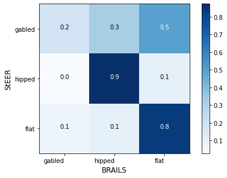

.. _lbl-roofClassifier-vnv:

Roof Classifier
========================

The Roof Classifier is validated here using three datasets.

Dataset 1: Compare with OpenStreetMap Labels
~~~~~~~~~~~~~~~~~~~~~~~~~~~~~~~~~~~~~~~~~~~~~

The trained classifier is first tested on a ground truth dataset that can be downloaded from `here <http://doi.org/10.5281/zenodo.4520781>`_.
We firstly obtained a set of randomly selected buildings in the United States with their roof type labelled on OpenStreetMap.
We then downloaded the satellite images from Google Maps for each building. 
We removed images in which we didn't clearly see there is a roof. 
The resulting dataset contains roof images in three categories: 32 flat, 40 gabled, 52 hipped. 
Examples of these satellite images can be found in :ref:`roofTheory`. 

For this dataset, the prediction accuracy is 90.3%. Precision is 90.3%. Recall is 90.3%. F1 is 90.3%.

Run the following python script to test on this dataset.

.. code-block:: python 

    
    import shutil
    import os
    import pandas as pd
    from glob import glob
    import wget
    import zipfile

    # download the testing dataset
    wget.download('https://zenodo.org/record/4520781/files/satellite-images-val.zip')
    with zipfile.ZipFile('satellite-images-val.zip', 'r') as zip_ref:
        zip_ref.extractall('.')

    # get images
    flatList = glob('satellite-images-val/flat/*.png')
    gabledList = glob('satellite-images-val/gabled/*.png')
    hippedList = glob('satellite-images-val/hipped/*.png')
    
    # define the paths of images in a list
    imgs=flatList+gabledList+hippedList
    
    # import the module
    from brails.modules import RoofClassifier

    # initialize a roof classifier
    roofModel = RoofClassifier()

    # use the model to predict
    predictions = roofModel.predict(imgs)
    
    prediction = predictions['prediction'].values.tolist()
    label = ['flat']*len(flatList) + ['gabled']*len(gabledList) + ['hipped']*len(hippedList)

    # lot results
    class_names = ['flat','gabled', 'hipped']
    from brails.utils.plotUtils import plot_confusion_matrix
    from sklearn.metrics import confusion_matrix
    from sklearn.metrics import f1_score,accuracy_score

    # print
    print(' Accuracy is   : {}, Random guess is 0.33'.format(accuracy_score(prediction,label)))
    cnf_matrix = confusion_matrix(prediction,label)
    plot_confusion_matrix(cnf_matrix, classes=class_names, title='Confusion matrix',normalize=True,xlabel='Labels',ylabel='Predictions')

The confusion matrix tested on this dataset is shown in :numref:`fig_confusion_roof`.

.. _fig_confusion_roof:
.. figure:: ../../images/technical/confusion_roof.png
  :width: 40%
  :alt: Confusion matrix roof

  Confusion matrix - Roof type classification for OpenStreetMap

Dataset 2: Compare with StEER Irma Dataset with Post-disaster Images
~~~~~~~~~~~~~~~~~~~~~~~~~~~~~~~~~~~~~~~~~~~~~~~~~~~~~~~~~~~~~~~~~~~~~~

.. raw:: html

    

The second validation dataset is from StEER, you can download it from `here <https://zenodo.org/record/4767858/files/Irma_roof_validation.zip>`_.
This dataset contains satellite images of building that are taken after Hurricane Irma and labels of roof shapes.

From StEER, we obtained a list of addresses with their roof types labelled. 
For each address, we downloaded an satellite image from Google Maps Static API.
It should be noted that these images were taken after the Hurricane Irma. 

.. role:: red

:red:`These post-disaster images are very different from the training dataset, in which all images are taken before the disasters. Keep in mind, the BRAILS roof model is not designed to recognize the post-disaster images. The aim of this validation is to see how BRAILS performs on these post-disaster images, though the model is not trained for this purpose.`

Examples of these satellite images can be found in :numref:`Irma_roof_examples`.

.. _Irma_roof_examples:
.. list-table::

    * - .. figure:: ../../images/technical/irma/TopViewx17346-Keystone-Road-Sugarloaf-Key-Monroe-Florida-.png

           A severely damaged building with its roof cover totally removed 

      - .. figure:: ../../images/technical/irma/TopViewx728-Grenada-Ln-Little-Torch-Key-Monroe-FL-.png

           A gabled roof with a temporary fix by partial covering with a blue tarp 

      - .. figure:: ../../images/technical/irma/TopViewx1114-Chokoloskee-Dr-Chokoloskee-Collier-FL-.png

           A building removed from the land, leaving an empty land

      - .. figure:: ../../images/technical/irma/TopViewx216-Goodland-Drive-East-Goodland-Collier-County-Florida-.png

           A building with a hipped roof that was not damage 
           

The labeling system of StEER is different from the BRAILS roof classification system. 
The StEER labels include the following classes:

* Gable                
* Hip                  
* Complex              
* Flat                 
* Hip/Gable            
* Hip,Complex          
* Gable,Complex        
* Other                
* Gable,Flat           
* Hip/Gable,Complex    
* Hip,Flat             
* Gambrel              
* Hip,Gable            
* Hip,Other            
* Hip/Gable,Flat  

The BRAILS roof types include the following classes:

* gabled
* hipped
* * flat

To compare these two systems, we selected addresses labeled as 'Flat', 'Gable', 'Hip' from StEER. 
As a result we got the following numbers of StEER labels:

* gabled,    459
* hipped,    180
* flat,       72

Download the labels, images, scripts for this validation from `here <https://zenodo.org/record/4767858/files/Irma_roof_validation.zip>`_.

The following show the script to run this validation.
It will use BRAILS to download images from Google Map Static API and perform predictions on these images.
At the end, the script will plot a confusion matrix and print the accuracy.

.. code-block:: python 

    import pandas as pd
    data = pd.read_csv("Irma_validation.csv")
    data.describe()

    # ### Use BRAILS to download satellite images

    # You don't have to download again, it's already included in this example
    # But feel free to uncomment and download again. You need a Google API Key, and set reDownloadImgs=True
    '''
    from brails.workflow.Images import getGoogleImagesByAddrOrCoord

    addrs =  list(data['Addr'])
    getGoogleImagesByAddrOrCoord(Addrs=addrs, GoogleMapAPIKey='Your-Key',
                                 imageTypes=['TopView'],imgDir='tmp/images',ncpu=2,
                                 fov=60,pitch=0,reDownloadImgs=False)
    '''
    data['TopViewImg']='tmp/images/TopView/TopViewx'+data['Addr'].str.replace(' ','-')+'.png'

    # ### Predict

    from brails.modules import RoofClassifier
    roofModel = RoofClassifier()
    roofPreds = roofModel.predict(list(data['TopViewImg']))

    data['RoofShape(BRAILS)']=list(roofPreds['prediction'])
    data['prob_RoofShape(BRAILS)']=list(roofPreds['probability'])
    roofDict = {'Gable':'gabled','Flat':'flat','Hip':'hipped'}
    data['RoofShape(StEER)']=data['roof_shape'].apply(lambda x: roofDict[x])

    # ### Plot confusion matrix

    import sys
    import matplotlib.pyplot as plt
    get_ipython().run_line_magic('matplotlib', 'inline')
    sys.path.append(".")

    from plotUtils import plot_confusion_matrix
    from sklearn.metrics import confusion_matrix
    from sklearn.metrics import f1_score,accuracy_score,f1_score

    class_names = list(data['RoofShape(BRAILS)'].unique())

    predictions = data['RoofShape(BRAILS)']
    labels = data['RoofShape(StEER)']

    cnf_matrix = confusion_matrix(labels,predictions,labels=class_names)
    plot_confusion_matrix(cnf_matrix, classes=class_names, normalize=True,xlabel='BRAILS',ylabel='StEER')

    for i,cname in enumerate(class_names):
        accuracy = '%.1f'%(cnf_matrix[i][i]/sum(cnf_matrix[i]))
        TP = cnf_matrix[i][i]
        FP = sum(cnf_matrix[:,i])-cnf_matrix[i,i]
        FN = sum(cnf_matrix[i,:])-cnf_matrix[i,i]
        F1 = '%.1f'%(TP/(TP+0.5*(FP+FN)))

        print(f'{cname}: Accuracy = {accuracy}, F1 = {F1}')

    # ### Copy images to directories {label}-{prediction} for inspection

    import os
    import shutil

    class_names = list(data['RoofShape(BRAILS)'].unique())

    if not os.path.exists('tmp/images/roof_predictions/'):
        os.makedirs('tmp/images/falsePreds/')

    for ind, row in data.iterrows():
        addrstr = row['Addr'].replace(' ','-')
        picname = f'tmp/images/TopView/TopViewx{addrstr}.png'

        label = row['RoofShape(StEER)']
        pred = row['RoofShape(BRAILS)']
        if True:
            thisFileDir = f'tmp/images/roof_predictions/{label}-{pred}/'
            if not os.path.exists(thisFileDir):
                os.makedirs(thisFileDir)
            shutil.copyfile(picname, thisFileDir+picname.split('/')[-1])

In the files you downloaded, there are folders with names like gabled-hipped, which means those are images that are labelled as 'gabled' in StEER dataset,
but they are predicted as 'hipped'. You can browse those images to investigate deeper.  

The confusion matrix tested on this dataset is shown in :numref:`fig_confusion_roof_irma`.

.. _fig_confusion_roof_irma:

  Confusion matrix - Roof type classification for Hurricane Irma

The accuracy for three classes are:

* gabled: Accuracy = 0.2, F1 = 0.3
* hipped: Accuracy = 0.9, F1 = 0.6
* flat:   Accuracy = 0.8, F1 = 0.3

It shows the accuracy for the gable is not as high as the other classes.
A further look into the images we found the following facts:

* Most roofs that are labelled as 'flat' and 'hipped' are not damaged during the hurricane.
* Roofs labelled as 'gabled' are the class got most damages. 
* When roofs are damaged, their satellite images are different from pre-disaster images. 
* This validation doesn't remove those images with an empty land, which negatively influences the accuracy.
* This validation doesn't consider the possible bias in the StEER labels, which also negatively influences the accuracy. 

