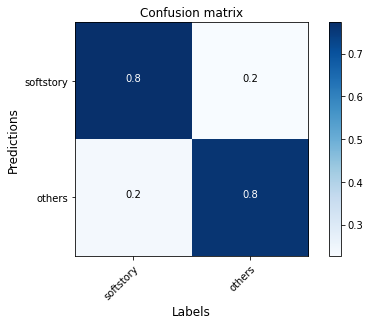

.. _lbl-softstoryClassifier-vnv:

Soft-story Building Classifier
===============================

The Soft-story Building Classifier is validated here.

The trained classifier is tested on a ground truth dataset that can be downloaded `here <https://zenodo.org/record/4508433/files/softstory-buildings-val.zip>`_.
Accuracy is 83.8%. Precision is 83.8%. Recall is 83.8%. F1 is 83.8%.

Run the following python script to test on this dataset.

.. code-block:: python 

    # download the testing dataset

    import wget
    import zipfile
    wget.download('https://zenodo.org/record/4508433/files/softstory-buildings-val.zip')
    with zipfile.ZipFile('softstory-buildings-val.zip', 'r') as zip_ref:
        zip_ref.extractall('.')

    # prepare the image lists

    import shutil
    import os
    import pandas as pd
    from glob import glob
    
    softstoryList = glob('softstory-buildings-val/softstory/*.png')
    othersList = glob('softstory-buildings-val/others/*.png')

    # define the paths of images in a list
    imgs=softstoryList+othersList
    
    # import the module
    from brails.modules import SoftstoryClassifier

    # initialize the classifier
    model = SoftstoryClassifier()

    # use the model to predict
    predictions = model.predict(imgs)
    
    prediction = predictions['prediction'].values.tolist()
    label = ['softstory']*len(softstoryList) + ['others']*len(othersList)

    # Plot results
    class_names = ['softstory','others']
    from brails.utils.plotUtils import plot_confusion_matrix
    from sklearn.metrics import confusion_matrix
    from sklearn.metrics import f1_score,accuracy_score

    print(' Accuracy is   : {}, Random guess is 0.5'.format(accuracy_score(prediction,label)))
    cnf_matrix = confusion_matrix(prediction,label)
    plot_confusion_matrix(cnf_matrix, classes=class_names, title='Confusion matrix',normalize=True,xlabel='Labels',ylabel='Predictions')

The confusion matrix tested on this dataset is shown in :numref:`fig_confusion_softstory`.

.. _fig_confusion_softstory:

  Confusion matrix - Soft-story building classifier