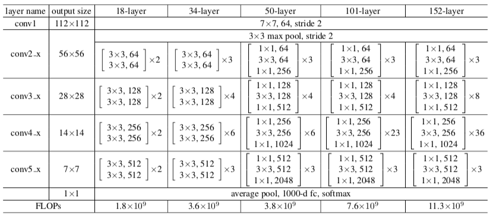

.. _softstoryTheory:

Soft-story
==========================

Structural deficiencies identification is a crucial task in seismic risk evaluation of buildings. 
In case of multi-story structures, abrupt vertical variations of story stiffness are known to significantly increase the likelihood of collapse during earthquakes. 
These buildings are called soft story buildings.
Identifying these buildings is vital in earthquake loss estimation and mitigation. 

One example of soft-story failure is shown in :numref:`ssexample`.

.. _ssexample:
.. list-table:: Soft-story failure

    * - .. figure:: ../../images/technical/ss.png
           :width: 60%

           Soft-story collapse

      - .. figure:: ../../images/technical/ss-frame.png
           :width: 60%

           Failure mechanism

The classifier is trained using a 50-layer ResNet :cite:`he2016deep`, a widely used ConvNet architecture for images feature recognition. 

Its architecture is shown in :numref:`fig_resnet`.

.. _fig_resnet:

  ResNet

   
