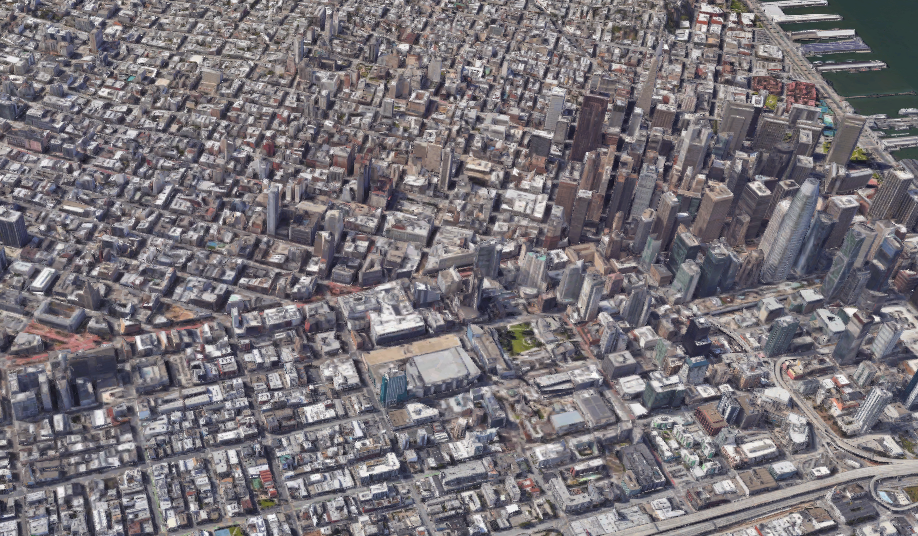
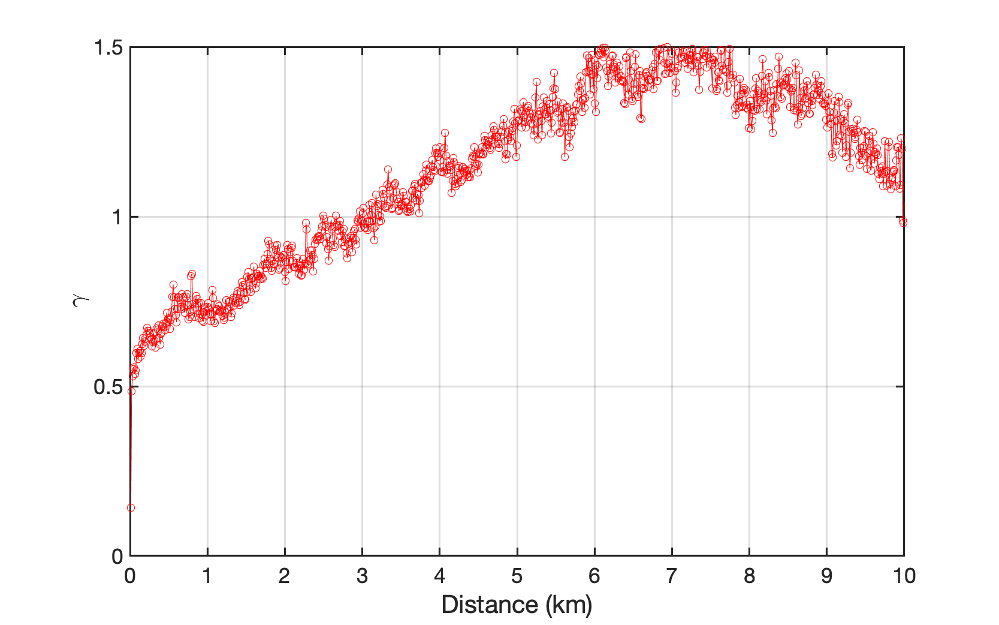
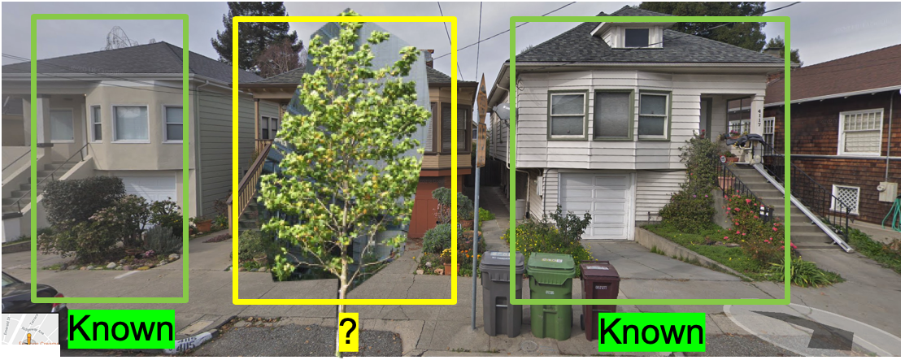

Theory and Implementation
==========================

The Framework
-----------------

A framework that works as an abstraction providing generic functionalities and can be selectively changed by additional user-written codes with user-provided input data, thus providing a region-specific building information harvesting tool, is presented in this section. 
The framework provides a standard way to create realistic building inventory databases and it is a universal, reusable environment that provides particular functionalities facilitating regional-scale building information modeling. 

As shown in :numref:`brailsPipeline`, the framework consists of two steps: data fusion and data enhancement. 

.. _brailsPipeline:

.. figure:: ../../images/pipeline.png
	:align: center
	:figclass: align-center

	Framework

Due to the complexity and the size of source data and the cost to collect it, 
building information at the regional-scale is usually not able to be inferred 
from a single resource but multiple resources, such as images, point clouds, 
property tax records, crowd sourcing map, etc. And these data usually belong 
to different owners and stored in different formats. 
The framework combines these sources using data fusion (or data integration), 
which is the process of integrating multiple building information data to produce 
more consistent, accurate, and useful information than that provided by any 
individual data source. 
The expectation is that fused building information data is more informative 
and synthetic than the original data.

The product of data fusion is an initial building inventory, 
in which a significant amount of building information is missing because of data scarcity. 
For example, crowd sourcing maps have issues with completeness, especially for rural regions. 
They are more complete in densely urbanized areas and targeted areas of humanitarian 
mapping intervention. Similarly, a significant amount of property tax assessment 
records are missing from administrative databases. The incompleteness issue is 
common for almost all data sources. In this framework, the missing values will 
be filled by modellings performed based on the incomplete initial database.  

Extracting building information from images
---------------------------------------------

An initial building inventory, containing basic indexing information such as addresses or coordinates of individual buildings, 
and other basic descriptions such as year built and structure type, has been created in the previous section. 
Based on the indexing information, satellite or street view images of each building can be retrieved using Google Maps API.  
Then, the deep learning technique ConvNet is utilized to extract building features 
(that don't exist in the initial database) from these images. 
ConvNet is a class of deep neural networks inspired by biological processes in that the connectivity pattern 
between neurons resembles the organization of the animal visual cortex :cite:`hubel1968receptive` and 
is most commonly applied to analyzing images. 
Individual cortical neurons respond to stimuli only in a restricted region of the visual field known as the receptive field. 
The receptive fields of different neurons partially overlap such that they cover the entire visual field. 

ConvNet is a supervised learning algorithm, which means the images need to be labeled for training. 
Therefore the most important part is to build a labeled dataset. 
OSM is a platform hosting real world infrastructure information labeled by human. 
For a typical building, the information might be found in OSM includes: height, number of stories, structure type, 
exterior material, footprint shape, usage, etc. These information are the valuable source for describing the built environment. 
However, only a limit number of buildings are labeled in OSM. 
In this study, the investigators propose to harvest these labels and associate them with images to build a database for deep learning. 
The ConvNets trained on these database are used to predict building properties 
when given any images containing unseen and unlabeled buildings. 
This way, as long as the satellite/street view images of a city can be obtained, 
a database of building information can be created. The pipeline to extract a specific building property 
from images is listed as following:

#. Identify a visually comprehensible building property (e.g., exterior construction material) that is intended to be extracted. 

#. Retrieve satellite/street view images of individual buildings from Google Map API

#. Label the retrieved images using tags (e.g., exterior construction material type) found in OSM

#. Train a ConvNet on the labeled images to classify between types 

#. Apply the trained ConvNet to unlabeled satellite / street view images of buildings in the city of interest

Repeat the above five steps for other building properties, 
such as number of stories, structural type, etc., as long as they can be visually identified from images. 
The ConvNet-identified building information is then merged into the initial database resulting in a more detailed inventory. 

It should be noted that, due to reasons like heavy occlusions in images or bad viewpoints,  
predictions from ConvNet are not always with acceptable confidence. To tackle this issue, in :numref:`enhance`, 
a machine learning based approach will be employed to enhance the database. 

Data fusion 
--------------

In order to combine building information obtained form different sources, 
a data fusion process is designed, as shown in :numref:`brailsFusion`.
There are two starting points of the data flow pipeline: one is the address list and the other one is the building footprints. 

The address list is used as the index for querying the supporting data sources (e.g., OSM, tax records, other user provided data, etc.). 
Once raw data is fetched from these sources, it will be filtered and cleaned to remove duplicated properties and then merged while missing values represented by place holders.

The building footprint is an important supporting data the framework relies on.
The method that is commonly used to get building footprints at a large scale is semantic segmentation on high-resolution 
satellite maps :cite:`li2019semantic,zhao2018building,bischke2019multi`. 
Since it is out of the focus of this study, instead of performing segmentation in the proposed framework on the fly, 
the framework retrieves footprints from a dataset released by :cite:`msfootprint`. 
This dataset contains footprints for almost all buildings in the United States extracted from high-resolution satellite maps. 
For regions outside of the United States, footprints can be inferred from satellite images using semantic segmentation methods in aforementioned  references. 
Each geotagged address has a unique coordinate, therefore can be merged with corresponding building footprints. 

Using address as the index, the aforementioned filtered and cleaned basic building information retrieved from multiple data sources can now be merged into the main stream of the data flow pipeline. For buildings with missing information, satellite and street view images of each building are then retrieved and fed into pretrained ConvNets, and predictions on the building features such as number of stories, roof types, etc., can be yield.
Merging the predicted values into the data stream results in the initial building database. 

.. _brailsFusion:

.. figure:: ../../images/Fusion.png
	:align: center
	:figclass: align-center

	Framework

.. _enhance:

Data enhancement
--------------------

Note that, after the fusion, the initial building database is still incomplete.
The reasons are: 
firstly no data source is perfect and there are usually a considerable amount of missing items in them;
secondly some missing values, for example the year of construction of an individual building, 
are either visually incomprehensible to a ConvNet, 
or for some visually comprehensible features, for example the number of stories, 
if the building is occluded by other objects, usually a tree or a car, in the image, 
which happens quite often, the feature can not be predicted accurately by ConvNets.
These reasons leave gaps in the initial building database. 
In this section, the authors propose a machine learning - based method to 
fill the gaps in the data.

Rather than merely a random assortment of objects in space, 
landscapes, natural resources, the human built environment, 
and other objects on Earth have orders, which can be described using a  
spatial patterns - a perceptual structure, placement, 
or arrangement of objects and the space in between those objects. 
Patterns may be recognized because of their distance, 
maybe in a line or by a clustering of points, and other arrangement types.

Such kind of spatial patterns, i.e., the arrangement of individual buildings 
in space and the geographic relationships among them, exist in the distribution of buildings, too.
Buildings, when built, usually have a relationship between each other, i.e., 
one building is located at a specific location is usually because of another. 
They can be clustered or dispersed based on their attributes, 
such as building type, value, construction material, etc., which are usually the 
manifestation of the demographic characteristics of neighborhoods, 
such as household income or race. 
For example, as the city shown in the map :numref:`brailsMapSF`,
there are areas denser with buildings than others and clusters of 
certain types of building are easy to be found in certain regions. 

.. _brailsMapSF:

	Satellite view of buildings in San Francisco

The capability of evaluating spatial patterns is a prerequisite to understanding the 
complicated spatial processes underlying the distribution of a phenomenon. 

In spatial statistics, the semivariogram is a function describing the degree of spatial 
dependence of a spatial random field or stochastic process. 
As such, statistics of spatial semivariogram provide a useful indicator of spatial patterns. 
Semivariogram is essentially  a meassure of the degree of dissimilarity between 
observations as a function of distance. It equals to half the variance of two 
random variables separated by a vector distance :math:`\boldsymbol{h}` 
:cite:`goovaerts1997geostatistics,vanmarcke2010random,wang2017spatial,wang2017hybrid`.

.. math::
    :label: eq:gamma

    \gamma (\boldsymbol{h})= \frac{1}{2}Var[Z(\boldsymbol{\mu}) - Z(\boldsymbol{\mu}+\boldsymbol{h})]

where :math:`Z(\boldsymbol{\mu})` is the observation at a spatial location :math:`\mu`; 
:math:`Z(\boldsymbol{\mu}+\boldsymbol{h})` is the observation at a spatial location :math:`\boldsymbol{\mu}+\boldsymbol{h}`. 

It is expected that buildings far away from each other will are more different 
than buildings that are close to each other. Because based on the first rule of 
geography that things close together are more similar than things far apart, 
semivariogram is generally low when two locations are close to each other 
(i.e. observations at each point are likely to be similar to each other. 
Typically, semivariogram increases as the distance between the locations 
grows until at some point the locations are considered independent of each other 
and semi-variance no longer increases.
In the case of buildings, 
semivariograms will give measures of how much two buildings will vary in attributes 
(such as height, number of stories, etc.) regarding to the distance between those samples. 

Using the semivariogram function, the authors investigated the spatial patterns of 
different building properties within a selected region. 
The results show that buildings were indeed built following certain spatial patterns. 
As a demonstration, the spatial semivariograms of two building properties, 
number of stories and year of construction, are plotted in :numref:`numofstories_semivariogram` 
and :numref:`yearofbuilt_semivariogram`. 
The horizontal axis represents the distance between a pair of buildings, while the vertical axis represents the dis-similarity of these buildings. 
The semivariogram figures show that with the increase of the distance between any two buildings, the dis-similarity between them, 
regrading to number of stories and the year of construction for an example, increased and then fluctuated. Apparently the incremental 
relationship between the distance and dis-similarity is neither linear nor following any obvious rule. 
Another note that deserves to be taken here is the curves revealed in :numref:`numofstories_semivariogram` and :numref:`yearofbuilt_semivariogram` 
are city- or region-specific, i.e., the semivariogram curve may reflect the truth of the region being investigated, and may not be exactly 
correct for describing another region. 
In other words, the spatial dependence of building features are regional-specific and the semivariogram curves vary regionally.  

.. _numofstories_semivariogram:

.. figure:: ../../images/correlation_numofstories.png
	:align: center
	:figclass: align-center

	Spatial patterns of building information expressed in semivariogram of the number of stories (The horizontal axis represents the distance between a pair of buildings, while the vertical axis represents the dis-similarity of these buildings.) These curves are calculated based on a building dataset covering four coastal cities in the Atlantic County, New Jersey

.. _yearofbuilt_semivariogram:

	Spatial patterns of building information expressed in semivariogram of the year of construction (The horizontal axis represents the distance between a pair of buildings, while the vertical axis represents the dis-similarity of these buildings.) These curves are calculated based on a building dataset covering four coastal cities in the Atlantic County, New Jersey

Since the semivariograms (:numref:`numofstories_semivariogram` and :numref:`yearofbuilt_semivariogram` ) 
clearly show there is a spatial pattern of the distribution of a certain building property, 
there must be a function for mapping neighbor information :math:`\boldsymbol{Z}_{p}` into :math:`Z_{n}`. 
This function can be constructed implicitly using a neural network. 

Imagine a neighborhood consisting of three buildings, :numref:`neighborhood`. 
Pretrained ConvNets can easily extract attributes of building at two ends, 
such as number of stories, occupancy, structure type, etc. 
However, for the building in the middle, which is heavily occluded by a tree in this case, 
no information can be extracted from the image with a satisfying confidence. 
However, it is possible to predict the features of the building in the middle based on the information of its neighbors, 
because :numref:`numofstories_semivariogram` and :numref:`yearofbuilt_semivariogram`  indicates that 
the attributes of buildings within a community are correlated with each other. 
The correlations can be learned by neural networks using `SURF <https://github.com/NHERI-SimCenter/SURF>`_.

.. _neighborhood:

	A neighborhood street view 

As mentioned in the previous sections, 
there is a significant portion of building information still missing from the 
initial database or can not be extracted from images. 
Using `SURF <https://github.com/NHERI-SimCenter/SURF>`_, 
the missing values can be predicted based on known values of neighboring buildings, 
hence the gaps in the initial database are filled and the regional building information database is enhanced. 
Details about how to do this can be found in the documentation of `SURF <https://github.com/NHERI-SimCenter/SURF>`_. 

.. bibliography:: references.bib 