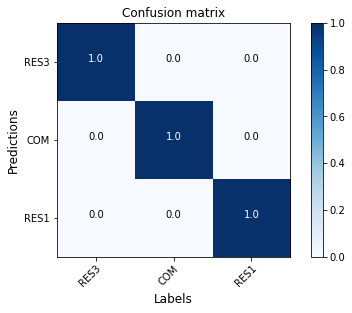
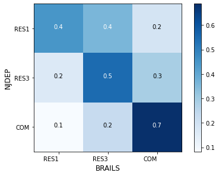

.. _lbl-understand:

Generalization
=============================

When applying the pre-trained models or training models with your own data, 
it is important to know your data, 
because how these models generalize to new and unseen data depends on how similar they are to the training data. 
Generalization of machine learning models remains an active research area. 
Users should exercise cautions when the modules are used beyond their intended purposes and trained model ability.
In this section, we show an example to demonstrate that different training datasets can produce difference performances of models tested on specific testing datasets.

In this example, we aim at training a classifier that can predict the occupancy type of a building given the street view image of the building. 

We first collected random records of United Sates building from OpenStreetMap (OSM) with their occupancy type labelled. 
These labels include 'detached', 'apartment', and 'commercial'. 
We renamed the labels to be consistent with the HAZUS naming system: 'RES1', 'RES3', 'COM'. 
These labels are split into training and testing sets. 

The training set (OSM-1) includes:

* 2,868 RES1
* 2,207 RES3
* 2,418 COM

The testing set (OSM-2) includes:

* 98 RES1
* 97 RES3
* 98 COM

For each labeled building, a street view image is then downloaded from Google Maps.
A ResNet50 model (model-1) is trained on the training set and tested on the testing set. 
For each class the accuracy is 100%, as shown in the confusion matrix :numref:`fig_confusion_x_occupancy_osm`. 

.. _fig_confusion_x_occupancy_osm:

  Confusion matrix (model-1 on OSM-2)

The performance is very high on the OSM testing set.
This is not surprising since both the training and testing datasets are from the same distribution.

We further obtained another dataset from New Jersey Department of Environmental Protection (NJDEP).
This dataset only covers buildings from New Jersey, in which each building's occupancy type is labeled.
These labels are split into two sets. 

The first set (NJDEP-1) contains: 

* 4,999 RES1
* 2,867 RES3
* 386 COM

The second set (NJDEP-2) contains: 

* 812 RES1
* 905 RES3
* 837 COM

We tested model-1 on the NJDEP-2 dataset. It's performance is plotted in the confusion matrix :numref:`fig_confusion_x_occupancy_njdep`. 
The performance dropped significantly on this dataset. 

.. _fig_confusion_x_occupancy_njdep:

  Confusion matrix (model-1 on NJDEP-2)

Later, another ResNet50 model (model-2) is trained on the combined dataset OSM-1 + NJDEP-1. 
The new model is tested on two datasets, OSM-2 and NJDEP-2, again.
As shown in :numref:`fig_confusion_x_occupancy_model2_osm2` and :numref:`fig_confusion_x_occupancy_model2_njdep2`.
The new models' performance on the OSM-2 dataset drops a bit, while it improved significantly on the NJDEP-2 dataset.

.. _fig_confusion_x_occupancy_model2_osm2:
.. figure:: ../../images/technical/confusion_occupancy_v2.png
  :width: 40%
  :alt: Confusion matrix occupancy class

  Confusion matrix (model-2 on OSM-2)

.. _fig_confusion_x_occupancy_model2_njdep2:
.. figure:: ../../images/technical/njdep/fig_confusion_occupancy_njdep_v2.png
    :width: 40%
    :alt: Confusion matrix occupancy class
  
    Confusion matrix (model-2 on NJDEP-2)

