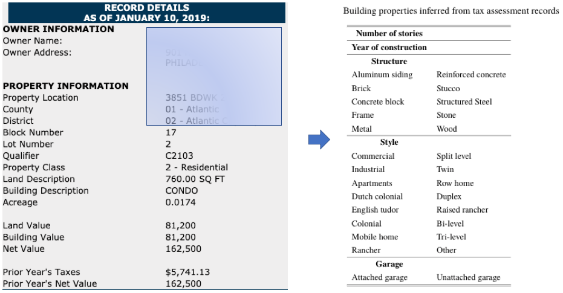
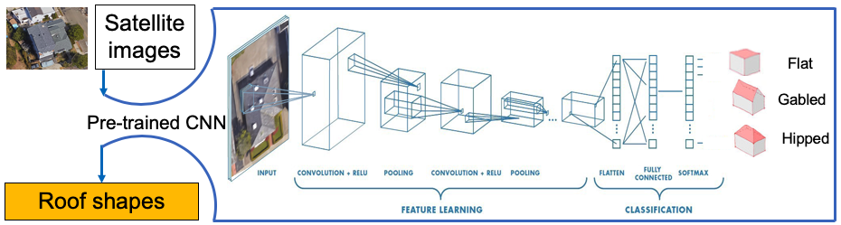
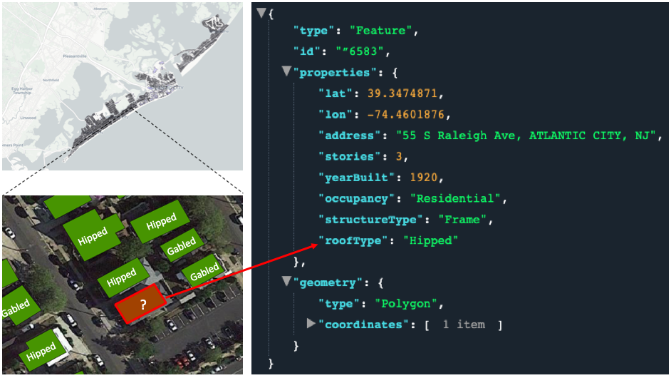
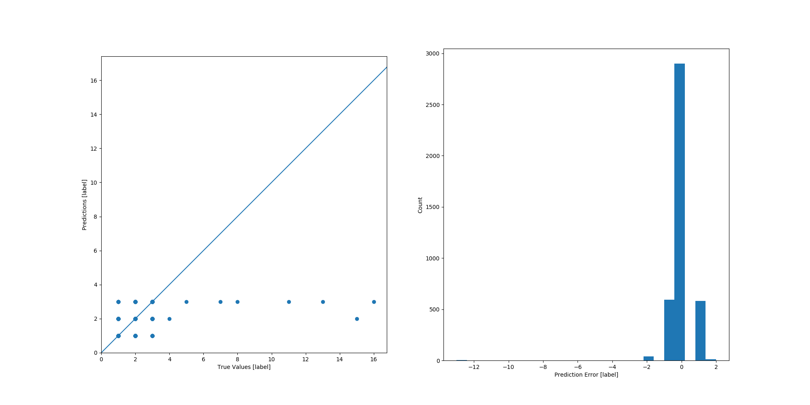
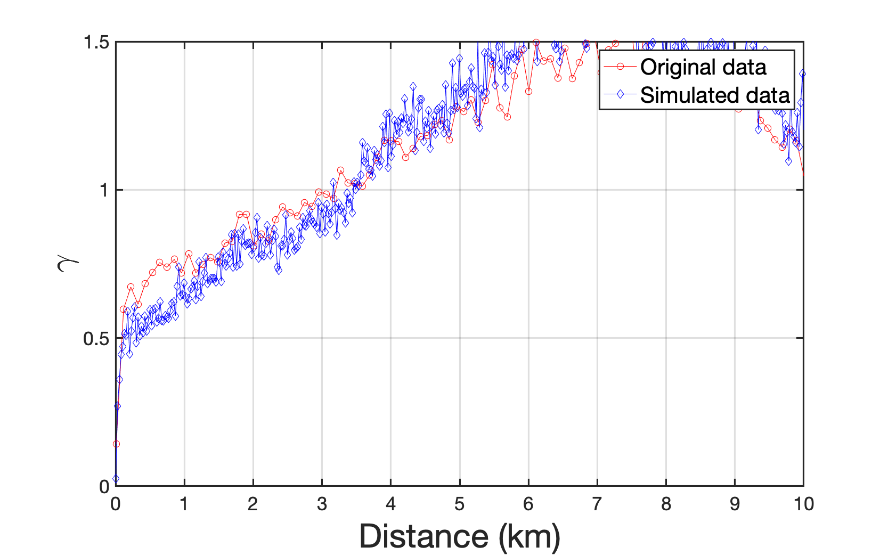

.. _lbl-vnv:

Verification and Validation 
=============================

Application example: Atlantic City Testbed
-------------------------------------------

.. note:: 

   To repeat this example, please follow :numref:`lbl-tutorial`. 

At the end of the workflow described in the previous sections, 
a regional building information database can be created. 
As a demonstration, this framework is applied to create a building inventory 
covering several coastal cities that are historically threatened by hurricanes in New Jersey. 

.. _fig:tax_record:

	Building information inferred from tax assessment record

In this implementation, three sources of data are fused to form a hybrid initial database of buildings. 
The first source is the tax assessment records which are scraped from the administrative website of
`the Department of Treasure of New Jersey <https://www.state.nj.us/treasury/taxation/lpt/TaxListSearchPublicWebpage.shtml>`_
as shown in :numref:`fig:tax_record`,
including number of stories, year of construction, structure type, occupancy. 
The second source is the United State Building Footprint dataset :cite:`msfootprint`.
The third source is satellite images, which can be download by calling Google Maps API.
When evaluating the loss caused by hurricanes, the roof type (flat, gabled, or hipped) is an important parameter to be considered. 
To obtain the roof type of every building in these coastal cities, 
the authors trained a ConvNet classifier, which takes a satellite image of a building as 
input and predict the roof type as the output, as shown in :numref:`fig:roofClassifier`. 
The training data contains 6,000 satellite images (2,000 for each roof type). 
The ConvNet architecture used here is InceptionV3 :cite:`szegedy2016rethinking`,
which is a widely-used image recognition model that has been shown to attain greater than 78.1% accuracy on the ImageNet dataset. 
The model is the culmination of many ideas developed by multiple researchers over the years. 
The model itself is made up of symmetric and asymmetric building blocks, 
including convolutions, average pooling, max pooling, concats, dropouts, and fully connected layers. 
Batchnorm is used extensively throughout the model and applied to activation inputs. 
Loss is computed via Softmax. By using the InceptionV3 model pretrained on the large scale dataset ImageNet as a startpoint, 
transfer learning is performed to train a roof classifier based on the satellite images. 
The accuracy of the trained classifier tested on a ground truth dataset :cite:`charles_wang_2019_3521067` is 85%.  

.. _fig:roofClassifier:

	Convolutional neural network for roof type classification

Using the proposed framework, the above data are fused and enhanced to form the regional BIM database.
As shown in :numref:`fig:demo`, about 20,000 buildings are modeled within this region and 
the BIM of a typical building is shown on the right side of :numref:`fig:demo`, 
in which several attributes are included: structure type, roof type, occupancy, 
number of stories, year of construction, footprint geometry.    

.. _fig:demo:

	Regional scale BIM database

During the data enhancement period, the prediction errors for building attributes 
(using number of stories and year built as examples) are shown in :numref:`fig:stories_error` and :numref:`fig:yearbuilt_error`. 
It can be seen that for the number of stories, 
the majority of the prediction errors are zero. 
For the year of construction, the majority of prediction errors are less than 10 years. 
Therefore, the prediction errors are considered as insignificant and the performance of SURF is believed to be satisfying. 

.. _fig:stories_error:

	Prediction error plot against 45 degree line & Histogram plot of prediction error (Number of stories)

.. _fig:yearbuilt_error:

.. figure:: ../../images/yearBuilt-prediction-error.png
	:align: center
	:figclass: align-center

	Prediction error plot against 45 degree line & Histogram plot of prediction error (Year of construction)

As shown in :numref:`fig:stories_error_correlation` and :numref:`fig:yearbuilt_error_correlation`, the semivariograms of the predicted building attributes are calculated and plotted against the observed values. The curves agree with each other very well, indicating that the spatial variation in the original dataset are preserved during the simulations. 

.. _fig:stories_error_correlation:

.. figure:: ../../images/correlation_numofstories_compare.png
	:align: center
	:figclass: align-center

	Comparison of semivariograms between original data and simulated data (Number of stories)

.. _fig:yearbuilt_error_correlation:

	Comparison of semivariograms between original data and simulated data (Year of construction)

It should be noted that, following the framework described in this documentation, 
one can add more building attributes of interests 
(e.g., window area, facade material, first floor elevation, and other features that are 
crucial to natural hazard loss estimation.) into the database by training ConvNets 
for each attribute as long as these attributes are visually comprehensible by the ConvNets.
In addition to the semantic representations, geometric features (such as building outlines) 
can also be extracted from images using ConvNets-based segmentation :cite:`bischke2019multi`. 
However, segmentation is not the focus of this study, therefore not elaborated here. 
The code, data, pre-trained ConvNets, and BIM database created by the implementation can be found in :cite:`BRAILS`. 

The BIM information shown in :numref:`fig:demo` is enough for describing a building 
when it comes to regional loss estimation of natural hazards, such as hurricanes. 

.. bibliography:: references.bib 