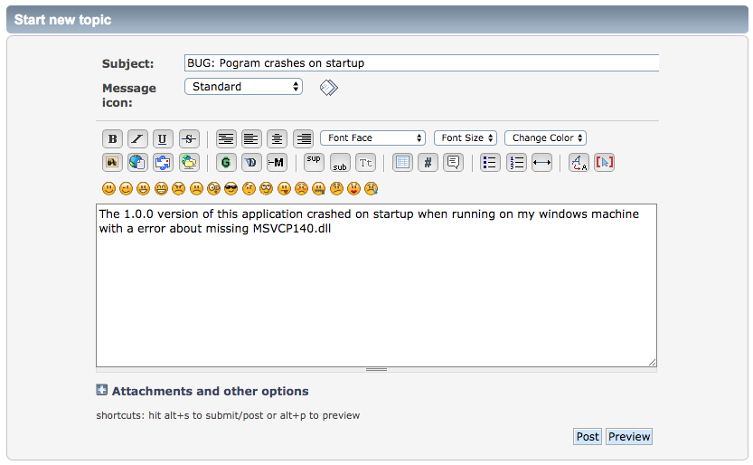

.. _lblBugs:

************************
Bugs & Feature Requests
************************

If you have feature requests, questions about how to install or use the application, or would like to report a bug, please post on the `Message board <https://simcenter-messageboard.designsafe-ci.org/smf/index.php?board=10.0>`_. 
To avoid duplication, try the `Search` feature before creating a `New Topic`. When creating a `New Topic` to report a bug or new feature request, it would be helpful if you could place in the `Subject` area, as shown in :numref:`figBugReport`, an indication of what the post is about:

   #. **BUG**, for bugs, i.e. BUG: Program crashes when starting
   #. **FEATURE**, for new feature requests, i.e. FEATURE: Incorporate OpenSeesPy

.. _figBugReport:

	Sample bug report submission to Message Board