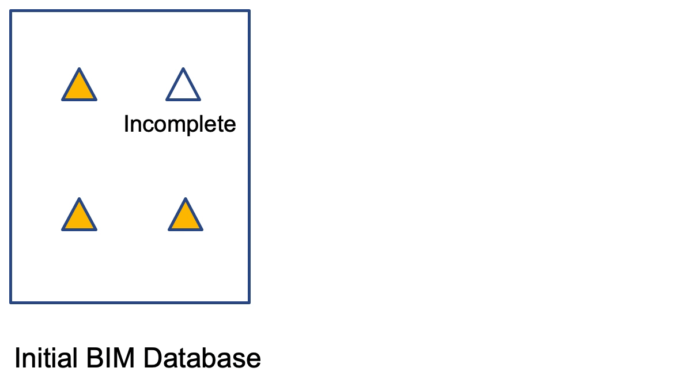

.. _lbl-enhance:

Enhance the data
================

  Data enhancement
  
To enhance the initial database, use `SURF <https://github.com/charlesxwang/SURF>`_ to predict missing building information.

For more information about *SURF*, read its `documentation <https://nheri-simcenter.github.io/SURF/>`_. 

To install *SURF*, run the following command in the terminal:

.. code:: none

    pip3 install pySURF

To enhance the initial database, run the following command in the terminal:

.. code:: none

    python3 SURF.ET-AI.py
    # the SURF.ET-AI.py file can be found in github
    # https://github.com/charlesxwang/SURF

After the running of the enhance script above, a new geojson file containing BIMs for the city will be generated.
The missing values in the initial database are now filled with predicted values.  

The following figures show the prediction errors for four building properties: year built, number of stories, structure type, occupancy.

.. figure:: ../../images/yearBuilt-prediction-error.png
  :width: 700
  :align: center
  :figclass: align-center

  Prediction error of year built

.. figure:: ../../images/stories_Predictions_classification_error.png
  :width: 700
  :align: center
  :figclass: align-center

  Prediction error of number of stories 

.. figure:: ../../images/structureType_Predictions_classification_error.png
  :width: 700
  :align: center
  :figclass: align-center

  Prediction error of structure type

.. figure:: ../../images/occupancy_Predictions_classification_error.png 
  :width: 700
  :align: center
  :figclass: align-center

  Prediction error of occupancy

