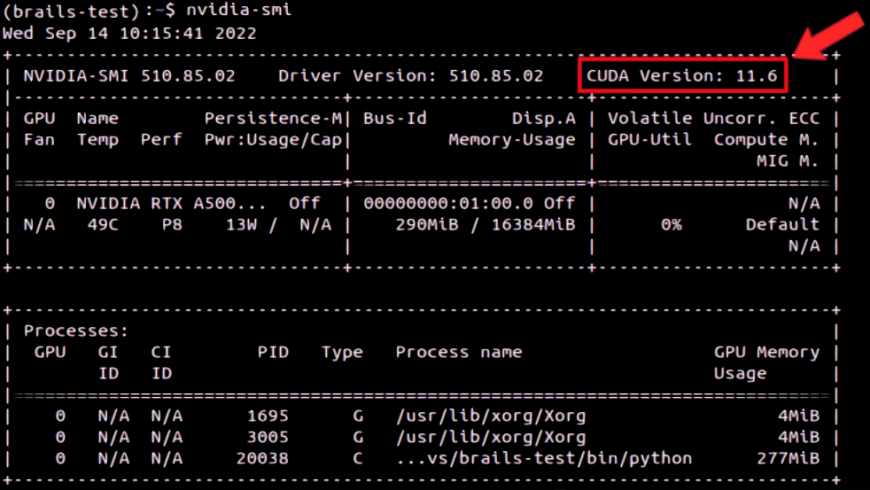
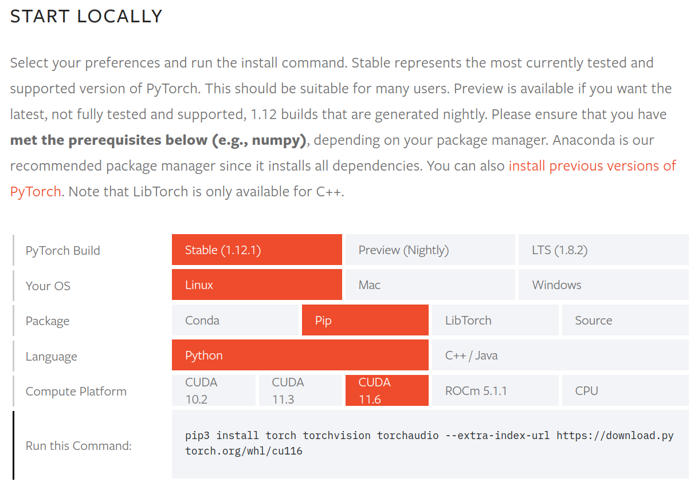

.. _lblTroubleshooting:

Troubleshooting
===============

CUDA Errors
^^^^^^^^^^^^^^^^^^^

The most common type of error observed when running |app| is a CUDA runtime error. If you see an error message similar to the one below when |app| attempts to run a deep learning model, PyTorch detected an incompatibility between the PyTorch and CUDA versions installed on your system.

.. code-block:: console

    RuntimeError: CUDA error: no kernel image is available for execution on the device

Installation instructions install the latest PyTorch version and the associated default CUDA version by default. If your computer is equipped with a graphics card (GPU) that does not support this default CUDA installation, you will need to reinstall PyTorch following the steps below.

1. Uninstall PyTorch and Torchvision::

    pip uninstall torch torchvision
    
2. Identify the highest CUDA version compatible with your GPU driver using::
    
    nvidia-smi

   For example, in the sample output shown below, the GPU driver installed on this system supports CUDA versions up to 11.6 (highlighted in the red box).

3. Determine the command for the PyTorch installation compatible with your CUDA version using the `PyTorch website <https://pytorch.org/get-started/locally/>`_ by selecting the operating system (OS) and CUDA version (as determined in Step 2) for your system. Please make sure to set the Package type and Language to `pip <https://pip.pypa.io/en/stable/installation/>`_ and Python, respectively. 

   The following example shows the command for installing PyTorch on a Linux system supporting CUDA versions up to 11.6. 

4. Run the `pip <https://pip.pypa.io/en/stable/installation/>`_ install command determined in Step 3. Please note that ``torchaudio`` is not required for running |app|, hence can be removed from this command.

API Key Errors
^^^^^^^^^^^^^^^^^^^^^
The trained models and accompanying datasets, when called the first time, need to be downloaded from the internet. Images also need to be downloaded during the running. Therefore, please make sure you are connected to the internet.
