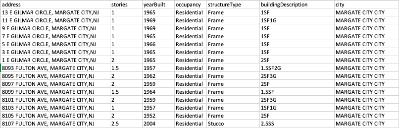

.. _lbl-preparedata:

Prepare and fuse data
======================

Get google map api key
--------------------------------------------------

Obtain the API key from `<https://developers.google.com/maps/documentation/embed/get-api-key>`_.

Define api key in src/keys.py file like this: 

.. code-block:: python 

    GoogleMapAPIKey = "replace this with your key" 

Prepare a list of building addresses in csv format
-------------------------------------------------------

For example, Atlantic_Cities_Addrs.csv looks like :numref:`address_list`.

.. _address_list:

	Address list

Noticing that, in addition to addresses, there are extra columns containing basic building information (e.g., stories, occupancy, etc.).
These basic information are scraped from tax websites. 
It should be noted that, for a portion of these buildings, some building information may be missing from the websites.
In this case, just leave them blank in csv file.

Once `Atlantic_Cities_Addrs.csv <https://berkeley.box.com/shared/static/hi0nzfykbadtczioj4tymrsjjgwahhbw.csv>`_ is prepared, define the path of it in src/confiugre.py like this:

.. code-block:: python 

    cleanedBIMFileName = dataDir+"/Atlantic_Cities_Addrs.csv"

Prepare a boundary file of the region of interest in geojson format
--------------------------------------------------

Define the path in src/configure.py like this:

.. code-block:: python 

    RegionBoundaryFileName = dataDir+"/AtlanticCoastalCities_Boundary.geojson"

For this demo, we have prepared this boundary file for you, download from `here <https://berkeley.box.com/shared/static/gfridzvcjo6k533554q9plh0g3v9fpzi.geojson>`_.

Prepare building footprints in geojson format
--------------------------------------------------

AI generated building footprints database -> `USBuildingFootprints <https://github.com/microsoft/USBuildingFootprints>`_.

We have prepared a cleaned version that just contains Atlantic coastal cities, download from `here <https://berkeley.box.com/shared/static/0ueibjzbo1b0mgru4h6n8l2rmww8nx0z.geojson>`_.

Define the path of this footprints file in src/configure.py like this:

.. code-block:: python 

    BuildingFootPrintsFileName = dataDir+"/AtlanticCoastalCities_Footprints.geojson"

Geocode buildings and create a basic BIM file for this region.
--------------------------------------------------

Define the file path to store BIM for all buildings in src/configure.py like this:

.. code-block:: python 

    resultBIMFileName = dataDir+"/Atlantic_Cities_BIM.geojson"

Then run the following command from src/preparedata (This will cost $ because it calls Google API. 
To avoid this, download the `Atlantic geocoding file <https://berkeley.box.com/shared/static/mb8dya89hslfj1eo8rzns2v6gllq4x68.zip>`_ and unzip it in your data/preparedata dir. 
The code will first look into this dir for geocoding information, if it was not there, the code will call Google API.)

.. code-block:: none 

    python geocoding_addr.py

This will create a BIM file Atlantic_Cities_BIM.geojson containing basic building information within the interested region.
The generated BIM file can be visulized in a GIS software, such as QGIS.

.. code-block:: none 

    {
    	"type": "FeatureCollection",
    	"features": [{
    			"type": "Feature",
    			"id": "8460",
    			"properties": {
    				"id": "8460",
    				"lat": 39.371879,
    				"lon": -74.456126,
    				"address": "1970 W RIVERSIDE DR, ATLANTIC CITY,NJ",
    				"stories": 2,
    				"yearBuilt": 2006,
    				"occupancy": "Residential",
    				"structureType": "Frame",
    				"buildingDescription": "2SF",
    				"city": "ATLANTIC CITY CITY"
    			},
    			"geometry": {
    				"type": "Polygon",
    				"coordinates": [
    					[
    						[-74.45606, 39.371837],
    						[-74.455935, 39.371934],
    						[-74.456037, 39.372013],
    						[-74.456162, 39.371916],
    						[-74.45606, 39.371837]
    					]
    				]
    			}
    		},
    		{
    			"type": "Feature",
    			"id": "8461",
    			"properties": {
    				"id": "8461",
    				"lat": 39.3716807,
    				"lon": -74.4513949,
    				"address": "1619 COLUMBIA AVE, ATLANTIC CITY,NJ",
    				"stories": 2,
    				"yearBuilt": 1979,
    				"occupancy": "Residential",
    				"structureType": "Frame",
    				"buildingDescription": "2SF",
    				"city": "ATLANTIC CITY CITY"
    			},
    			"geometry": {
    				"type": "Polygon",
    				"coordinates": [
    					[
    						[-74.451353, 39.371717],
    						[-74.451493, 39.371755],
    						[-74.451526, 39.37168],
    						[-74.451386, 39.371643],
    						[-74.451353, 39.371717]
    					]
    				]
    			}
    		}
    	]
    }
 

