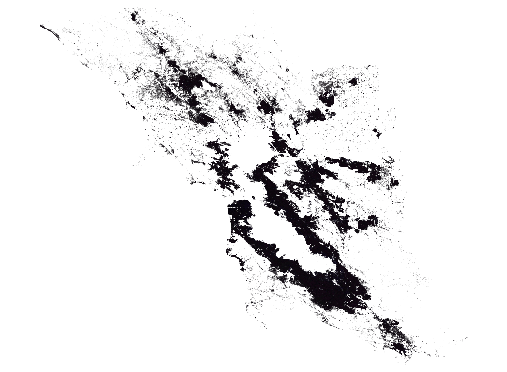

# San Francisco Bay Area Building Information Modeling

This folder contains a building inventory for the San Francisco Bay Area.

This inventory covers 1,825,178 buildings modeled by BRAILS. 

The download link for version 0.1 is [BayAreaBuildings-v0.1.zip](https://berkeley.box.com/shared/static/8xfvculsfrevw82iwf6ozqeo53xrremj.zip)



Fig. 1 Buildings by BRAILS


## bayarea_buildings.csv
|Column        | Description           |
| ------------- |:-------------|
|id	            | unique id of a building (int)|
|longitude	    | longitude (double)|
|latitude	    | latitude (double)
|stories	        | number of stories (int)|
|yearbuilt	    | year built (int)|
|occupancy	    | Hazus building occupancy type (string)|
|structure	    | Hazus building structure type (string)|
|areafootprint   | area (sqm) of building footprint (double)|

## bayarea_buildings.geojson

```json
{ 
    "type": "Feature", 
    "properties": 
    { 
        "id": 5246, 
        "longitude": -121.57312937917344, 
        "latitude": 37.16239427810558, 
        "stories": 1, 
        "yearbuilt": 1951, 
        "occupancy": "RES1", 
        "structure": "W1", 
        "areafootprint": 136.15712 
    }, 
    "geometry": 
    { 
        "type": "Polygon", 
        "coordinates": [ [ [ -121.5731, 37.162324 ], [ -121.573041, 37.162417 ], [ -121.573158, 37.162465 ], [ -121.573218, 37.162371 ], [ -121.5731, 37.162324 ] ] ] 
    } 
}
```

## Hazus building occupancy categories

```json
{
    "Other/Unknown": "RES1",
    "Residential - Single-Family": "RES1",
    "Residential - Town-Home": "RES3",
    "Residential - Multi-Family": "RES3",
    "Residential - Mixed Use": "RES3",
    "Office": "COM4",
    "Hotel": "RES4",
    "School": "EDU1",
    "Industrial - Light": "IND2",
    "Industrial - Warehouse": "IND2",
    "Industrial - Heavy": "IND1",
    "Retail": "COM1",
    "Parking" : "COM10"
}
```

## Hazus building structure categories

Table 5-2: Structural Building Classifications (Model Building Types) in 

Hazus Earthquake Model User Guidance (version 4.2.3)

## Contact

Charles Wang, c_w@berkeley.edu

## Reference
Charles Wang, Qian Yu, Frank McKenna, Barbaros Cetiner, Stella X. Yu, Ertugrul Taciroglu & Kincho H. Law. (2019, October 11). NHERI-SimCenter/BRAILS: v1.0.1 (Version v1.0.1). Zenodo. http://doi.org/10.5281/zenodo.3483208
